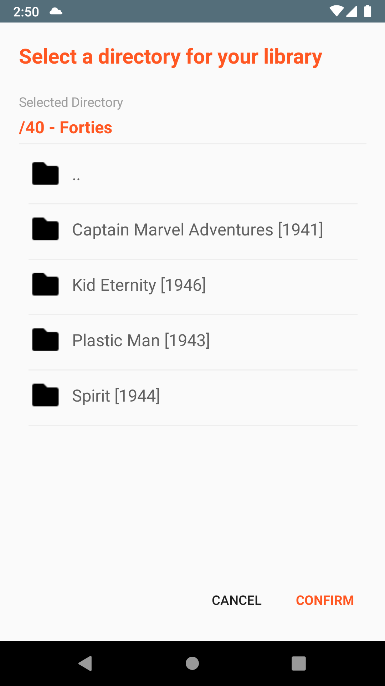

# Comics Shelf

Mobile viewer for comic book **cbz** files, done as a learning path to **Xamarin framework**.

## A litle history first


I'm a comic book reader (and collector) for a long time. And, as a developer, i wanted to study and learn a new programing language (in this case, Xamarin). So i put this things togheter and decided to make a CBZ file reader that would meet my needs.  
With the result already satisfying me, i decided to publish the app in the store to facilitate the distribution to the friends who started to ask me to install it on their devices.  
In fact, this is the result of a learning work, but done with love and dedication. All critics and suggestion will be welcomed. 

## Say hello to your final comic book viewer

The definitive lightweight viewer for your comic book files.  
It's really straightforward.  
Select a folder on your device (or your OneDrive account) where you put your comic books (those CBZ files).  
The app will continually search your folder for newly added files.  
Then extract covers and display it as a eye candy shelf.  
You click the one you want to read, and start fliping the pages.  
The app will learn from your reading habits and suggest other comics from your library for you.  
Happy reading. 

## Some screenshots

<p align="center">
  
    
    
      
</p>

### For a better experience in the shelf layout, we suggest the following formatting of your comic folders: 
```
Your library main folder
├── Comics from the forties (some kind of section description)
│   ├── Kid Eternity [1946]
│   │   ├── Kid Eternity [1946] #01
│   │   └── Kid Eternity [1946] #02
│   └── Spirit [1944] 
│       ├── Spirit [1944] #01 
│       ├── Spirit [1944] #02
│       └── Spirit [1944] #03
└── Comics from the sixties
   └── The Peacemaker [1967]
       ├── The Peacemaker [1967] #01
       └── The Peacemaker [1967] #02
```

## Try it out

We placed a test version that can be accessed through the link below. 

[play.google.com/store/apps/details?id=com.friendship.ComicsShelf](https://play.google.com/store/apps/details?id=com.friendship.ComicsShelf)

## Built With

* [Xamarin Forms](https://docs.microsoft.com/pt-br/xamarin/xamarin-forms)
* [Xamarin Essentials](https://docs.microsoft.com/en-us/xamarin/essentials/)
* [OneDrive Connector](https://github.com/LeversonCarlos/Xamarin.OneDrive.Connector)
* [Http Zip Stream](https://github.com/LeversonCarlos/HttpZipStream)

## Authors

* [Leverson Carlos](https://github.com/LeversonCarlos)
* [other contributors](https://github.com/LeversonCarlos/ComicsShelf/graphs/contributors)

## License

MIT License - see the [LICENSE](LICENSE) file for details
